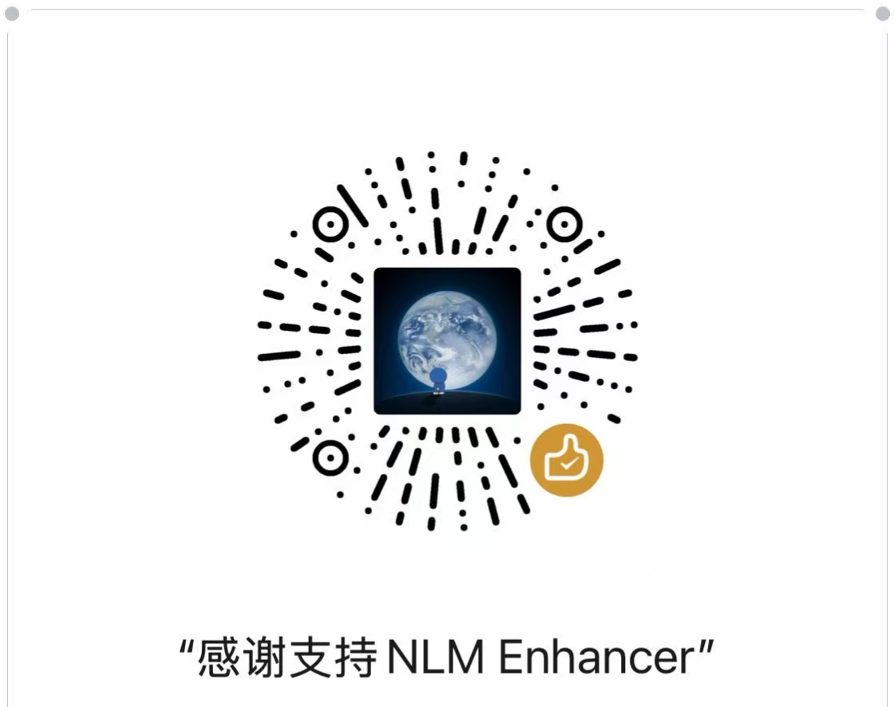

[English](./README_EN.md) | [简体中文](./README.md)

<div align="center">

# 📓 NLM Enhancer

### LaTeX Export for NotebookLM

[](https://opensource.org/licenses/MIT)
[](https://github.com/komazhou/NLM-Enhancer)
[](https://github.com/komazhou/NLM-Enhancer)

**Fix broken math formula exports from Google NotebookLM — no more garbled symbols, blank boxes, or red diamonds.**

</div>

---

## 🎯 The Problem

When working with math-heavy academic notes in NotebookLM, you've likely encountered:

- 📋 **Copy formulas to Markdown** → red diamonds `◆` or blank boxes `□`
- 📄 **Export to Microsoft Word** → integrals, matrices, and subscripts turn into gibberish
- 📝 **Paste into note-taking apps** → formulas simply vanish, leaving only placeholders

**NLM Enhancer** solves this at the root. It intercepts rendered math on the page, precisely extracts the LaTeX source code, and ensures your mathematical notes reproduce perfectly in any editor.

---

## ✨ Features

### 📐 LaTeX Formula Export (Core Feature)

- **Click to copy**: Click any rendered math formula to extract and copy its LaTeX source
- **Multiple formats**: LaTeX `$...$`, MathML (Word), plain text, Notion `$$...$$`
- **Smart selection copy**: Select a paragraph containing formulas, Ctrl+C to get complete LaTeX-interleaved text
- **Precise extraction**: Calculus, matrices, fractions, sub/superscripts, Greek letters — all handled accurately

### 🔘 Chat Timeline Navigation

- Dot-based timeline on the right side representing your questions
- Click any dot to jump directly to that question
- Hover to preview question content
- Left-side search panel for fuzzy-searching your question history

### 📥 Clean Markdown Export

- One-click export of the current conversation as a clean Markdown file
- Automatically strips NotebookLM's citation markers, action buttons, and other UI clutter
- Export preview supports per-message deletion for selective export
- Also supports Save as PDF

### 💬 One-Click Quote

- Select any reply text to reveal a floating "Quote" button
- Click to insert the content as a formatted quote into the input box
- Preserves LaTeX formula syntax — quoted content retains its formatting

### ⚡ Prompt Vault

- Built-in prompt templates (summaries, Feynman explanations, comparative analysis, etc.)
- Support for custom prompt creation
- One-click insertion into the input box

### ⚙️ Input Enhancements

- **Draft Recovery**: Auto-saves input box content; restores after page refresh
- **Ctrl+Enter to Send**: Enter inserts a new line instead, preventing accidental sends
- **Prevent Auto-Scroll**: Scroll up to review history during AI generation without being snapped back

---

## 📦 Installation

> Currently in developer preview. Not yet available on the Chrome Web Store.

### Developer Mode Installation

1. **Clone the repository**
   ```bash
   git clone https://github.com/komazhou/NLM-Enhancer.git
   ```

2. **Open Chrome Extensions page**
   - Navigate to `chrome://extensions/`
   - Enable "Developer mode" in the top-right corner

3. **Load the extension**
   - Click "Load unpacked"
   - Select the cloned `NLM-Enhancer` folder

4. **Start using**
   - Open [NotebookLM](https://notebooklm.google.com/)
   - Click the NLM Enhancer icon in your browser toolbar to manage feature toggles

---

## 🔒 Privacy & Security

**NLM Enhancer is committed to zero intrusion on user data.**

| Item | Status |
|------|--------|
| Network Requests | ❌ **Zero network requests** — all features run locally |
| Data Collection | ❌ **Zero data collection** — no tracking, no reporting, no analytics |
| Third-Party Services | ❌ No external APIs or analytics platforms |
| Data Storage | ✅ Only uses `chrome.storage` for user preferences |
| Permission Scope | ✅ Only activates on `notebooklm.google.com` |

You can audit the complete source code anytime: [GitHub Repository](https://github.com/komazhou/NLM-Enhancer)

---

## 🤝 Support the Developer

If NLM Enhancer has been helpful for your studies or research, consider buying the author a coffee ☕

<div align="center">



*Scan to support via WeChat*

</div>

---

## 📄 License

This project is open-sourced under the [MIT License](https://opensource.org/licenses/MIT).
